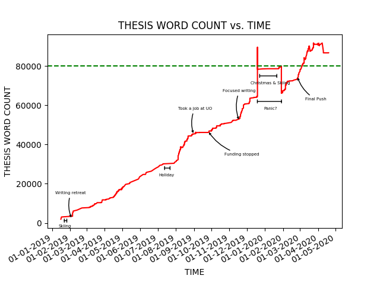

<p align="center"> 

</p>

# My Ph.D. thesis written in LaTeX

### Abstract

This PhD research explores more inclusive and participatory ways of designing data-driven, people-centred smart city tools that serve the needs of citizens. In contrast to passive participation through data, this research focuses on ways of using data and technology for bringing people together to address issues in the community, and to intervene in the public space. Through different case studies I explore the role of data in civic participation and advocacy, focusing on active participation through data and digital tools that support collaborative sensemaking of that data.

## Declaration

This theis is incordance with _Newcastle University's Guidelines for the Submission and Format of Theses_ found at https://www.ncl.ac.uk/students/progress/assets/documents/GuidelinesfortheSubmissionandFormatofThesis-November2018.pdf

This thesis is using a _Newcastle University template_ by André Catarino Guerra, available at https://github.com/AndreGuerra123/NUTT. Thanks for uploading the source on GitHub!

Also using some styles adapted from _CUED LaTeX template_ by Krishna Kumar, available at https://github.com/kks32/phd-thesis-template.

Added publications section to list all the publications related to the thesis.

Thesis was written in _Overleaf_ (https://www.overleaf.com/) platform, and then cloned here.

## Counting Words

To count words over time in Tex files use a _Git Count Words_ LateX script by Bastian Rieck, available at https://gist.github.com/Submanifold/d7b996492dc3020f2acea87b49cc54c3.


### to use it

```
$ ./word_count.sh
# to generate progress graph
$ ./word_count.sh | ./makegraph.py 
```

## Table of Contents

Coming Soon
